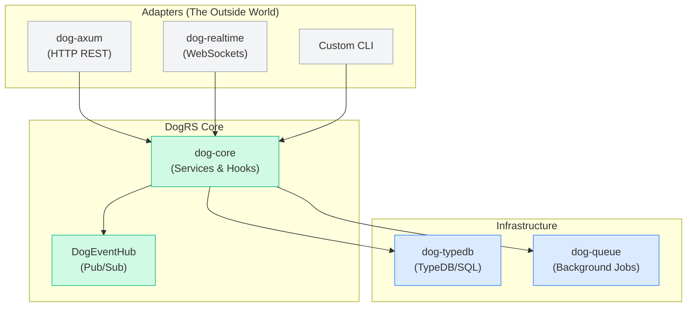

# DogRS

A modular Rust framework with multi-tenant services, hooks, and pluggable storage. Built to keep your core logic independent from your transport layer.

DogRS is inspired by the simplicity of FeathersJS, but designed for Rust. It provides a clean foundation for building flexible applications where you can simultaneously expose services across multiple transports, swap storage backends on the fly, and scale without rewriting your business logic.

## Features

- **Multi-tenant by default**  
  Every request and operation runs with an explicit tenant context.

- **Service hooks**  
  Write your validation, logging, and data transformation logic once as hooks, and attach them anywhere in the request lifecycle (before/after/error).

- **Pluggable storage backends**  
  Bring your own database or mix multiple databases per tenant (SQL, TypeDB, Memory, etc.).

- **Adapter-based architecture**  
  Expose the exact same service over Axum (REST), WebSockets, and gRPC simultaneously.

- **No stack lock-in**  
  DogRS keeps your core logic portable.



- **Read-Path Optimized**  
  Using the `DogAppBuilder` pattern, the dependency injection and hook registries are frozen at startup. This means your application's hot paths scale cleanly across threads without heavy lock contention.

## Published Crates

All DogRS crates are available on [crates.io](https://crates.io):

### Core Framework
- **[dog-core](https://crates.io/crates/dog-core)** → The framework-agnostic core (services, hooks, tenant contexts).

### Web & Realtime Adapters
- **[dog-axum](https://crates.io/crates/dog-axum)** → Mount your services as HTTP REST endpoints using Axum.
- **dog-realtime** *(Upcoming)* → WebSocket and SSE streaming for realtime service events.

### Data & Infrastructure
- **[dog-queue](https://crates.io/crates/dog-queue)** → A multi-tenant job queue with lease-based processing, idempotency, and a unified builder API.
- **[dog-typedb](https://crates.io/crates/dog-typedb)** → TypeDB integration with query builders and adapters.
- **[dog-blob](https://crates.io/crates/dog-blob)** → Blob storage adapter with S3 compatibility and streaming support.

### Auth
- **[dog-auth](https://crates.io/crates/dog-auth)** → Authentication service and JWT management.
- **[dog-auth-oauth](https://crates.io/crates/dog-auth-oauth)** → OAuth2 strategies for Google, GitHub, and others.

### Schema & Validation
- **[dog-schema](https://crates.io/crates/dog-schema)** → Schema definition utilities.
- **[dog-schema-macros](https://crates.io/crates/dog-schema-macros)** → Procedural macros for generating schemas.
- **[dog-schema-validator](https://crates.io/crates/dog-schema-validator)** → Advanced runtime validation utilities.

## Quick Start

Add DogRS crates to your project:

```bash
# Core framework
cargo add dog-core

# Web development with Axum
cargo add dog-axum dog-core

# Background jobs
cargo add dog-queue
```

## Docs

- [Design Architecture](docs/design.md)
- [Configuration](docs/configuration.md)

## Examples

Check the `dog-examples/` directory for full working applications:
- `auth-demo` → End-to-end OAuth2 login flow.
- `fleet-queue` → TypeDB and Axum integration.
- `music-blobs` → Realtime streaming and blob storage.

## Status

DogRS is in active development. The goal is to build a simple but powerful foundation for Rust applications without forcing you into a fixed technology stack.

---

<div align="center">
Made by <a href="https://github.com/Jitpomi">Jitpomi</a>
</div>