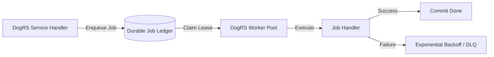

# Asynchronous Pipelines & Distributed Queues

`apps/business` offloads all heavy and non-blocking operations to **`dog-queue`** and **`dog-blob`**.

---

## 1. Background Queues (`dog-queue`)

Using PostgreSQL or Redis durable ledgers, workers process tasks asynchronously with automatic retry, dead-letter queue (DLQ) isolation, and metrics:



### Job Definitions

| Queue Name | Job Type | Payload Schema | Processing Mode |
|---|---|---|---|
| `business.billing.invoices` | `GenerateInvoicePdf` | `{"tenant_id": "...", "invoice_id": "..."}` | Concurrent worker |
| `business.billing.renewals` | `ProcessSubscriptionRenewals` | `{"billing_date": "2026-10-07"}` | Cron schedule (`0 0 1 * *`) |
| `business.webhooks.dispatch` | `DispatchWebhook` | `{"url": "...", "event": "...", "signature": "..."}` | Rate-limited retry |
| `business.notifications` | `SendEmailAlert` | `{"recipient": "...", "template": "...", "data": {...}}` | High throughput |

---

## 2. Cron & Scheduled Tasks

`dog-queue` with `cron-scheduling` handles automated recurring business processes:

```rust
use dog_queue::codec::EnqueueOptions;
use dog_queue::DogQueue;

pub async fn schedule_recurring_billing(queue: &DogQueue) -> anyhow::Result<()> {
    // Schedule monthly subscription renewals at 00:00 on the 1st of every month
    queue.schedule_cron(
        "business.billing.renewals",
        "0 0 1 * *",
        &serde_json::json!({ "operation": "monthly_renewals" }),
    ).await?;
    Ok(())
}
```

---

## 3. Blob & Media Storage Pipeline (`dog-blob`)

All uploaded documents, contracts, and receipts are isolated per tenant in S3-compatible object storage:

- **Bucket Key Structure**: `tenants/{tenant_id}/documents/{year}/{month}/{document_id}.bin`
- **Streaming Uploads**: Memory is bounded (no large multi-gigabyte files loaded into RAM).
- **Resumable Multipart Coordination**: Upload chunks can be paused and resumed seamlessly.
