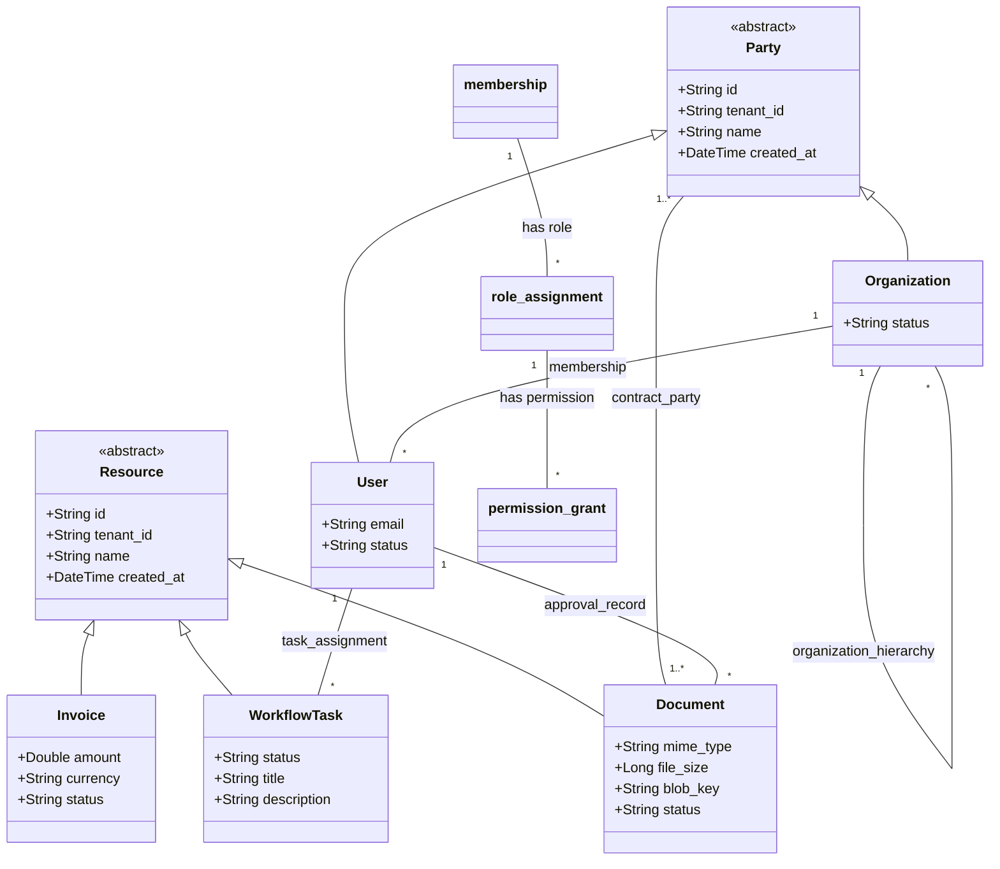

# TypeDB Knowledge Graph Ontology Specification

This document details the data modeling philosophy, schema structure, and query patterns for the TypeDB 3.x knowledge graph underlying **`apps/business`**.

---

## 1. Modeling Philosophy

Traditional relational databases force business models into flat tables with dozens of foreign key join tables (`user_organizations`, `organization_roles`, `role_permissions`, `parent_organizations`). 

In `apps/business`, the schema utilizes **TypeDB 3.x** polymorphic entities, hyper-relations, and deductive reasoning rules:

1. **Polymorphic Types**: `party` serves as an abstract root for `organization` and `user`. Any relation that can connect to a party (like `contract_party`) automatically works with individuals or corporate entities without union tables.
2. **Hyper-Relations**: Relations can relate other relations directly. For example, `role_assignment` relates an existing `membership` relation, avoiding synthetic composite IDs.
3. **Automated Rule Inference**: Permissions and memberships across organizational hierarchies (e.g. parent company executives having automatic administrative authority over regional subsidiaries) are derived at query time by the TypeDB reasoning engine rather than written to persistent tables.

---

## 2. Entity & Relation Diagram



---

## 3. Standard TypeQL Query Patterns

### A. Inserting a New Organization with an Owner Membership
```typeql
match
  $u isa user, has id "usr_123";
insert
  $org isa organization,
    has id "org_456",
    has tenant_id "org_456",
    has name "Acme Corporation",
    has status "active",
    has created_at 2026-10-07T00:00:00;
  $m (org: $org, member: $u) isa membership,
    has status "active",
    has created_at 2026-10-07T00:00:00;
  $role (assigned_membership: $m) isa role_assignment,
    has role_name "owner";
```

### B. Resolving User Permissions in a Tenant (With Inference)
```typeql
match
  $u isa user, has id "usr_123";
  $org isa organization, has id "org_child_789";
  $m (org: $org, member: $u) isa membership, has status "active";
  (assigned_membership: $m) isa role_assignment, has role_name $role;
  (granted_role: $role) isa permission_grant, has permission_code $perm;
fetch {
  "user_id": $u.id,
  "role": $role,
  "permission": $perm
};
```

### C. Fetching Documents Requiring User Approval
```typeql
match
  $u isa user, has id "usr_123";
  $doc isa document, has status "pending_approval";
  (approver: $u, target_resource: $doc) isa approval_record, has status "pending";
fetch {
  "doc_id": $doc.id,
  "name": $doc.name,
  "blob_key": $doc.blob_key
};
```

---

## 4. Integration with `dog-typedb`

In Rust services, queries are executed through `dog_typedb::TypeDbAdapter`:

```rust
use dog_typedb::{TypeDbAdapter, TypeDbConfig};
use anyhow::Result;

pub async fn load_business_schema(adapter: &TypeDbAdapter) -> Result<()> {
    let schema_content = include_str!("../schema/business.tql");
    adapter.define_schema(schema_content).await?;
    tracing::info!("TypeDB business schema & inference rules successfully committed.");
    Ok(())
}
```
