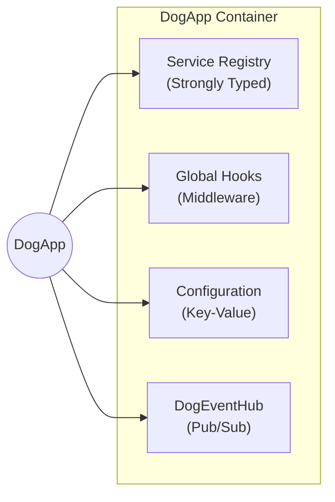
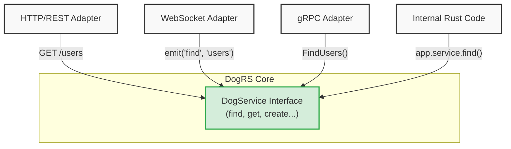
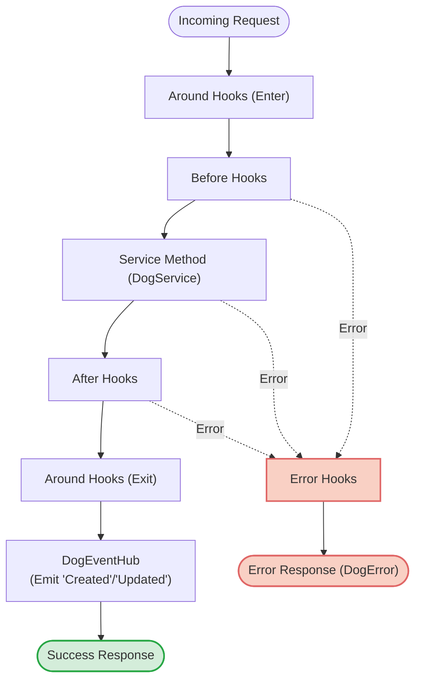

# Architecture: The `dog-core` Framework

`dog-core` is the foundational layer of the DogRS framework. It provides the core abstractions for building highly scalable, transport-agnostic, and format-agnostic applications in Rust. 

## Why Adopt This Architecture? (The Benefits)

Before diving into the technical mechanics, it is crucial to understand *why* `dog-core` is architected this way. By adopting this framework, teams unlock massive productivity and scalability gains:

### 1. Write Business Logic Once
Because services are purely transport-agnostic, you write your domain logic exactly once. 
```rust
// 1. Define your core logic once
async fn get(&self, _ctx: &TenantContext, id: &str, _params: P) -> Result<User> {
    db.fetch_user(id).await
}

// 2. Call it seamlessly from anywhere!
// From an internal background worker:
let user = app.service("users")?.get(tenant, "123", params).await?;

// Or from an HTTP adapter (automatically routed)
// GET /users/123
```
That exact same codebase instantly powers your HTTP REST API, your real-time WebSocket streams, and your internal gRPC calls without writing duplicate "controller" routing logic.

### 2. Infinite Reusability via Hooks
Instead of scattering validation, authorization, and logging code throughout your endpoints, you write small, isolated, testable Hooks. You can then plug these Hooks onto any service method in the application.
```rust
// Write a portable hook once
struct EnforceAuth;

#[async_trait]
impl DogBeforeHook<User, Params> for EnforceAuth {
    async fn run(&self, ctx: &mut HookContext<User, Params>) -> Result<()> {
        if !ctx.tenant.is_authenticated() { 
            anyhow::bail!("Unauthorized!"); 
        }
        Ok(())
    }
}

// Plug it in globally (or per-service)
app.hooks(|h| {
    h.before_all(Arc::new(EnforceAuth));
});
```

### 3. Automated Real-Time Reactivity
The integrated Event Hub automatically broadcasts `Created`, `Updated`, and `Removed` events anytime a mutation occurs successfully. This makes building real-time frontends and data-sync engines effortless.
```rust
// Listen to any successful 'create' on the 'messages' service
app.service("messages")?.on(
    ServiceEventKind::Created, 
    Arc::new(|data, _ctx| {
        println!("New message created! Broadcast to WebSockets: {:?}", data);
        Box::pin(async { Ok(()) })
    })
);
```

### 4. Dynamic Feel, Rust Speeds
By leveraging Rust's strict typing and the `Arc<dyn Any>` polymorphic pattern, the framework provides the rapid-prototyping, flexible feel of Node.js (FeathersJS) or Python, while executing at raw C-like speeds with guaranteed memory safety.

---

## 1. Core Philosophy

The architecture of `dog-core` is heavily inspired by FeathersJS, but built specifically for Rust to be fast, safe, and highly concurrent. 

The three main pillars of `dog-core` are:
- **Transport Agnosticism:** Your business logic never knows *how* it was called. The core code knows nothing about HTTP headers, WebSockets, or gRPC. It just takes data in and gives data out.
- **Dependency Injection (DI-first):** Components like Hooks and Services should be small and portable. Instead of relying on hidden global variables, they should be given exactly what they need when they are created.
- **Format Agnosticism:** The core data structures don't force you to use specific serialization formats (like JSON) if you are building a fast, binary-only microservice.

---

## 2. The Application Container (`DogApp`)

The `DogApp` is the central hub of a DogRS application.



It acts as a lightweight container that holds:
- **Service Registry:** A safe map of all your registered services.
- **Global Hooks:** Middleware that runs on every service call across the application.
- **Event Hub:** The central pub/sub system for real-time events.
- **Configuration:** A safe key-value store for application config (`DogConfig`).

**How it works in Rust:** 
In Javascript, you can throw anything into an app object. In Rust, things need to be strictly typed. `DogApp` handles the complex Rust under-the-hood (using `Arc<dyn Any>`) so you get the easy, dynamic feel of `app.set("key", value)` while ensuring you get safe, perfectly typed data when you ask for it back!

---

## 3. Transport-Agnostic Service Interfaces (`DogService`)

At the heart of `dog-core` is the `DogService` trait. It defines standard, predictable CRUD-like interfaces:
- `find`: Query and retrieve multiple records.
- `get`: Retrieve a single record by its ID.
- `create`: Insert a new record.
- `update`: Fully replace an existing record.
- `patch`: Partially modify an existing record.
- `remove`: Delete a record.
- `custom`: Dynamic routing for domain-specific RPC methods.

**Crucially, these interfaces are completely transport-agnostic.** 



Because they only accept pure Rust generics (`R` for the Record, `P` for the Parameters, and a `TenantContext`), the exact same service method can be invoked seamlessly via a REST API, a WebSocket event, a gRPC call, or an internal Rust function call. The adapter layer handles the protocol translation, keeping your business logic pristine.

---

## 4. The Hooks Pipeline

Hooks are the middleware of `dog-core`. They allow you to cleanly separate cross-cutting concerns (like validation, authorization, logging, and data shaping) from your core service logic.

The `HookContext` flows through a strict execution pipeline on every service call:



1. **Around Hooks:** Wrap the entire execution (useful for transaction management or profiling).
2. **Before Hooks:** Modify the input parameters or context *before* the service executes.
3. **Service Call:** The actual `DogService` method runs.
4. **After Hooks:** Modify the output data *after* the service executes.
5. **Error Hooks:** Catch and handle failures if any step in the pipeline returns an error.

### DI-First vs. Context Lookup
`dog-core` encourages a **Dependency Injection (DI) first** approach. Hooks should ideally hold their own configuration via `Arc` when registered. However, for maximum flexibility, `dog-core` provides an optional Feathers-like runtime lookup escape hatch via `ctx.services` and `ctx.config` for hooks that dynamically need to query other domains (e.g., an authorization hook querying a user roles service).

---

## 5. Event Hub (`DogEventHub`)

`dog-core` features a deeply integrated, real-time event system. 

If a service call executes successfully through the pipeline, the framework automatically intercepts the result and emits standard events based on the method:
- `create` → Emits `ServiceEventKind::Created`
- `update` / `patch` → Emits `ServiceEventKind::Updated`
- `remove` → Emits `ServiceEventKind::Removed`

Applications can easily subscribe to these events (e.g., `app.on_str("messages", ...)`) to trigger background jobs, sync caches, or broadcast WebSocket messages to connected clients, completely decoupling the publisher from the subscriber.

---

## 6. Format-Agnostic Errors

`dog-core` provides robust error handling structures (`DogError`). As a foundational layer, these errors can be serialized into any data format (JSON, Bincode, MessagePack, TOML, etc.) depending entirely on the needs of the consuming application.

### Dynamic Data Handling
Errors often need to carry dynamic metadata payloads. To support this without forcing heavy dependencies onto binary-only microservices, `dog-core` uses a flexible feature model:

- **Default JSON Support:** By default, `dog-core` compiles with the `json` feature. The dynamic `ErrorValue` type maps directly to `serde_json::Value`, providing maximum convenience for standard REST APIs.
- **Pure Format-Agnostic Mode:** For high-performance binary systems, developers can set `default-features = false`. This removes `serde_json` and activates the internal `DogValue` enum — a structured value type for attaching metadata payloads:
  - Variants: `Null`, `Bool(bool)`, `Integer(i64)`, `Float(f64)`, `String(String)`, `Array`, `Object`
  - `Integer` and `Float` are distinct variants — `i64` precision is preserved for large values (IDs, timestamps) that `f64` would silently corrupt above 2^53
  - `Object` uses `BTreeMap<String, DogValue>` for deterministic, alphabetically-sorted field order across all serializers
  - **Serialization** works for all formats including non-self-describing (Bincode, MessagePack) — `serialize_*` primitives don't require type metadata in the stream.
  - **Deserialization** works for self-describing formats: JSON ✅, TOML ✅, YAML ✅, MessagePack ✅. Bincode ❌ by design — Bincode stores no type metadata, so `deserialize_any` (required by `#[serde(untagged)]`) is not supported.
  - Use `DogValue::float(v)` (returns `Option<DogValue>`) to reject `NaN`/`Infinity` at construction time — these are not valid in JSON or TOML and will cause a serialization error.

### Wire-Format Compliance
Regardless of which serialization format or feature is used, `DogError` strictly adheres to the FeathersJS client specification over the wire. The custom `Serialize` implementation guarantees that:
1. The `class_name` internal field is automatically mapped to `className` in the output.
2. Internal server stack traces (the `source` field) are securely stripped and never sent over the network.

---

## 7. The DogRS Ecosystem

`dog-core` is the engine, but it doesn't handle the networking by itself. It is designed to be plugged into adapter crates to actually expose your services to the world.

The standard ecosystem includes:

### Core Engine
- **`dog-core`**: The transport-agnostic engine, DI container, and Hooks pipeline (You are here).

### Adapters (Networking)
- **`dog-axum`**: The HTTP layer that automatically mounts your `dog-core` services as REST endpoints using the Axum web framework.

### Authentication & Identity
- **`dog-auth`**: Core authentication hooks and JWT management.
- **`dog-auth-local`**: Local email/password authentication strategy.
- **`dog-auth-oauth`**: OAuth2 authentication strategy (Google, GitHub, etc.).

### Validation & Data Modeling
- **`dog-schema`**: Core schema abstractions for defining API payloads.
- **`dog-schema-macros`**: Powerful procedural macros for generating schemas.
- **`dog-schema-validator`**: Runtime payload validation.

### Data & Infrastructure
- **`dog-typedb`**: Type-safe, ORM-like database adapters.
- **`dog-blob`**: Abstracted blob storage (S3, local filesystem).
- **`dog-queue`**: Production-grade multi-tenant job queue with lease-based at-least-once semantics, tenant isolation, idempotency, and pluggable backends (Memory, Redis, PostgreSQL).

---

## Next Steps

Ready to see the architecture in action?
- Head over to the **[Quickstart Guide](../README.md)** to build your first transport-agnostic service.
- Explore the **`examples/`** folder to see how Hooks, Services, and Adapters wire together in a real application.
