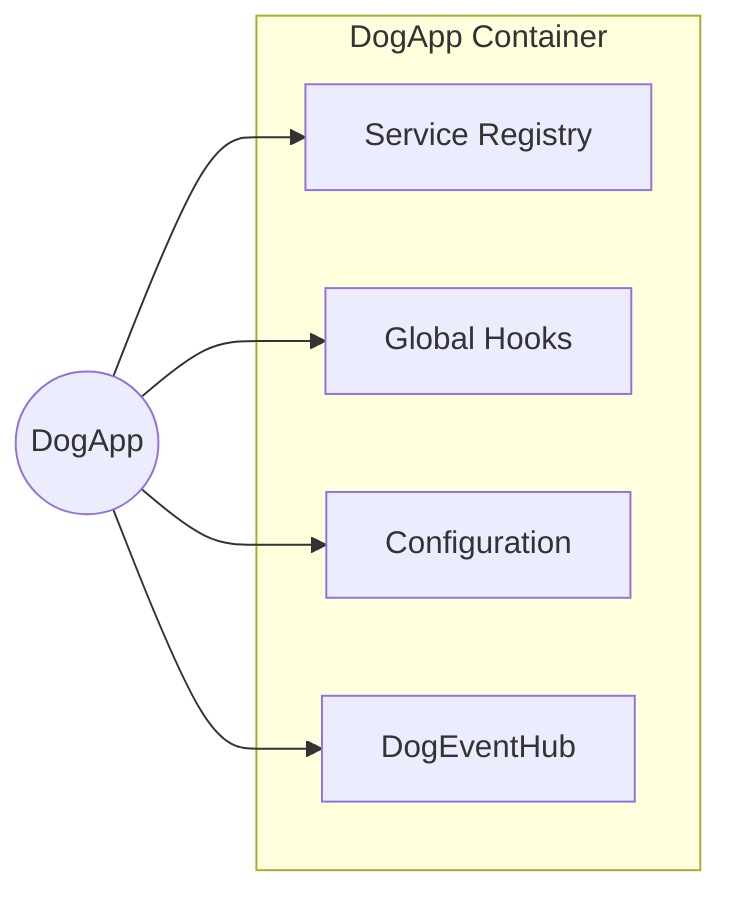
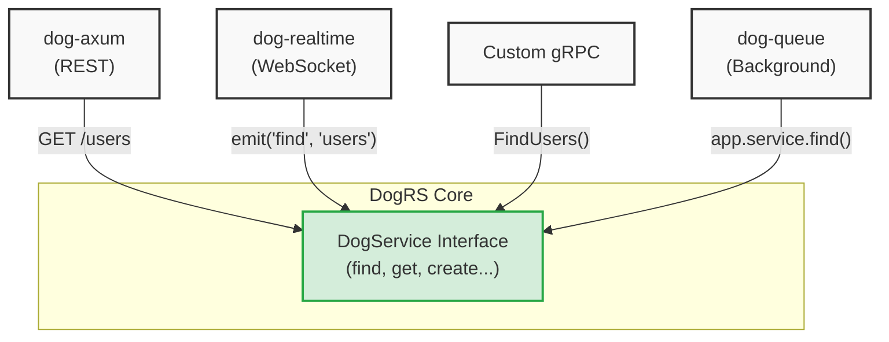
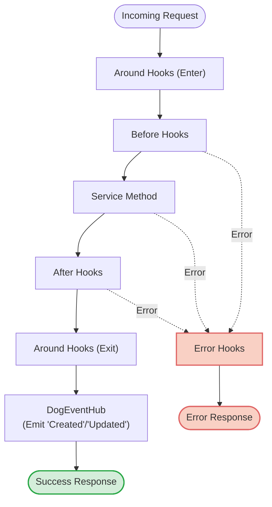

# Architecture: The `dog-core` Framework

`dog-core` is the foundational layer of the DogRS framework. It provides the core abstractions for building scalable, transport-agnostic, and format-agnostic applications in Rust. 

## Why Adopt This Architecture?

By adopting this framework, you can decouple your business logic from your infrastructure.

### 1. Write Business Logic Once
Because services are transport-agnostic, you write your domain logic exactly once. 

```rust
// 1. Define your core logic once
async fn get(&self, _ctx: &TenantContext, id: &str, _params: P) -> Result<User> {
    db.fetch_user(id).await
}

// 2. Call it seamlessly from anywhere!
// From an internal background worker:
let user = app.service("users")?.get(tenant, "123", params).await?;

// Or from an HTTP adapter (automatically routed)
// GET /users/123
```
That exact same codebase powers your HTTP REST API, your WebSocket streams, and your background jobs without writing duplicate "controller" routing logic.

### 2. Reusable Hooks
Instead of scattering validation, authorization, and logging code throughout your endpoints, you write small, isolated Hooks. You can then attach these Hooks to any service method.

```rust
// Write a portable hook once
struct EnforceAuth;

#[async_trait]
impl DogBeforeHook<User, Params> for EnforceAuth {
    async fn run(&self, ctx: &mut HookContext<User, Params>) -> Result<()> {
        if !ctx.tenant.is_authenticated() { 
            anyhow::bail!("Unauthorized!"); 
        }
        Ok(())
    }
}

// Plug it in globally (or per-service)
app.hooks(|h| {
    h.before_all(Arc::new(EnforceAuth));
});
```

### 3. Real-Time Events
The integrated Event Hub broadcasts `Created`, `Updated`, and `Removed` events anytime a mutation occurs successfully. This makes building real-time frontends and data-sync engines straightforward.

```rust
// Listen to any successful 'create' on the 'messages' service
app.service("messages")?.on(
    ServiceEventKind::Created, 
    Arc::new(|data, _ctx| {
        println!("New message created! Broadcast to WebSockets: {:?}", data);
        Box::pin(async { Ok(()) })
    })
);
```

### 4. Dynamic Feel, Rust Speeds
By using Rust's strict typing and the `Arc<dyn Any>` pattern, the framework provides the flexible feel of Node.js (FeathersJS), while executing at raw Rust speeds with guaranteed memory safety.

---

## 1. Core Philosophy

The architecture of `dog-core` is inspired by FeathersJS, but built for Rust.

- **Transport Agnosticism:** Your business logic never knows *how* it was called. The core code knows nothing about HTTP headers, WebSockets, or gRPC.
- **Dependency Injection (DI-first):** Components like Hooks and Services should be small and portable. They should be given exactly what they need when they are created.
- **Format Agnosticism:** The core data structures don't force you to use specific serialization formats (like JSON) if you are building a fast, binary-only microservice.

---

## 2. The Application Container (`DogApp`)

The `DogApp` is the central hub of a DogRS application.



It acts as a lightweight container that holds:
- **Service Registry:** A map of all your registered services.
- **Global Hooks:** Middleware that runs on every service call across the application.
- **Event Hub:** The central pub/sub system for real-time events.
- **Configuration:** A key-value store for application config (`DogConfig`).

---

## 3. Transport-Agnostic Service Interfaces (`DogService`)

At the heart of `dog-core` is the `DogService` trait. It defines standard CRUD interfaces:
- `find`: Query and retrieve multiple records.
- `get`: Retrieve a single record by its ID.
- `create`: Insert a new record.
- `update`: Fully replace an existing record.
- `patch`: Partially modify an existing record.
- `remove`: Delete a record.
- `custom`: Dynamic routing for domain-specific RPC methods.



Because these methods only accept generic types, the exact same service method can be invoked seamlessly via a REST API, a WebSocket event, a background job, or an internal Rust function call. The adapter layer handles the protocol translation.

---

## 4. The Hooks Pipeline

Hooks are the middleware of `dog-core`. They allow you to separate cross-cutting concerns (like validation, authorization, logging) from your core service logic.

The `HookContext` flows through a strict execution pipeline on every service call:



1. **Around Hooks:** Wrap the entire execution (useful for transaction management or profiling).
2. **Before Hooks:** Modify the input parameters or context *before* the service executes.
3. **Service Call:** The actual `DogService` method runs.
4. **After Hooks:** Modify the output data *after* the service executes.
5. **Error Hooks:** Catch and handle failures if any step in the pipeline returns an error.

---

## 5. Event Hub (`DogEventHub`)

`dog-core` features an integrated event system. 

If a service call executes successfully through the pipeline, the framework automatically intercepts the result and emits standard events based on the method:
- `create` → Emits `ServiceEventKind::Created`
- `update` / `patch` → Emits `ServiceEventKind::Updated`
- `remove` → Emits `ServiceEventKind::Removed`

Applications can subscribe to these events to trigger background jobs, sync caches, or broadcast WebSocket messages to connected clients. The Event Hub uses a snapshot-based, read-path optimized concurrency model, ensuring that listeners never block the hot-path execution of your services.

---

## 6. The DogRS Ecosystem

`dog-core` is the engine, but it is designed to be plugged into adapter crates to actually expose your services to the world.

### Core Engine
- **`dog-core`**: The transport-agnostic engine, DI container, and Hooks pipeline (You are here).

### Adapters (Networking)
- **`dog-axum`**: The HTTP layer that automatically mounts your services as REST endpoints using the Axum web framework.
- **`dog-realtime`** *(Upcoming)*: WebSocket and SSE streaming for realtime service events.

### Authentication & Identity
- **`dog-auth`**: Core authentication hooks and JWT management.
- **`dog-auth-local`**: Local email/password authentication strategy.
- **`dog-auth-oauth`**: OAuth2 authentication strategy (Google, GitHub, etc.).

### Validation & Data Modeling
- **`dog-schema`**: Core schema abstractions for defining API payloads.
- **`dog-schema-macros`**: Procedural macros for generating schemas.
- **`dog-schema-validator`**: Runtime payload validation.

### Data & Infrastructure
- **`dog-typedb`**: Type-safe database adapters for TypeDB.
- **`dog-blob`**: Abstracted blob storage (S3, local filesystem).
- **`dog-queue`**: Multi-tenant job queue with lease-based processing, tenant isolation, idempotency, and pluggable backends (Memory, Redis, PostgreSQL).

---

## Next Steps

- Head over to the **[Quickstart Guide](../README.md)** to build your first transport-agnostic service.
- Explore the **`dog-examples/`** folder to see how Hooks, Services, and Adapters wire together in a real application.
