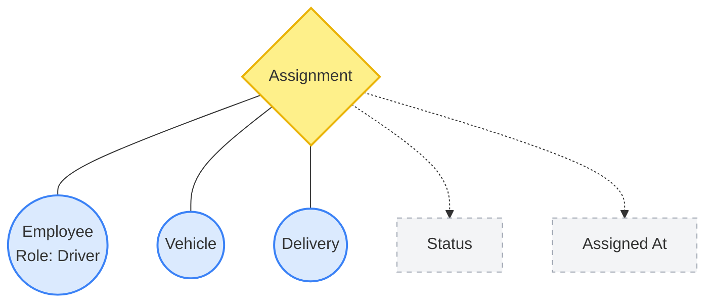

# Fleet Command Enterprise 🚛

Fleet Command is a production-grade fleet management and queueing system built with **Rust (Axum)**, **Vanilla JS/Tailwind**, and powered by **TypeDB**.

This project serves as a practical, comprehensive demonstration of how **TypeDB** solves complex, highly-relational data modeling problems that are typically cumbersome or inefficient in traditional SQL or NoSQL databases.

## Why TypeDB? (Demonstrated Capabilities)

This application specifically highlights three core superpowers of TypeDB:

### 1. N-ary (Hypergraph) Relations
In traditional SQL, assigning a driver, a vehicle, and a delivery to a single operational event requires clunky "junction tables" with multiple foreign keys. In TypeDB, this is modeled as a natural, single **ternary relationship**:
```tql
relation assignment,
  relates assigned-delivery,
  relates assigned-vehicle,
  relates assigned-employee,
  owns assigned-at,
  owns assignment-status;
```



When an assignment is created, it natively binds all three entities together. The frontend dashboard leverages this to instantly connect vehicles to their delivery destinations and calculate routes on the fly without complex `JOIN` logic.

### 2. Logic & Inference Rules (`functions.tql`)
TypeDB allows you to push business logic down to the database layer via inference rules. Instead of writing massive backend functions to filter eligible drivers, the database infers eligibility dynamically.

For example, the schema defines rules to automatically match "premium" deliveries with highly-rated drivers:
```tql
fun premium_delivery_assignments($delivery: delivery) -> { employee }:
    match 
        $delivery has customer-priority "premium";
        $employee isa employee, has employee-role "driver", has performance-rating >= 4.0, has employee-status "available";
    return { $employee };
```

### 3. Complex Graph Traversal in a Single Query
Fleet logistics require resolving multi-dimensional constraints. The frontend `app.js` executes queries that seamlessly traverse the graph to find optimal operational states. 

For example, to find an available vehicle, the query simultaneously checks for:
- Vehicles with `maintenance-status "good"` and `fuel-level >= 50.0`
- A lack of conflicting `assignment` relations for that specific time slot
- The geographical coordinates of the vehicle (`gps-latitude` / `gps-longitude`)
- The certification requirements (e.g. CDL-A or Hazmat) mapping from the vehicle to the prospective driver.

What would take hundreds of lines of application code and database ORM joins is resolved securely and natively by TypeDB's pattern-matching engine.

## Getting Started

### Prerequisites
- Rust (Cargo)
- Node.js & npm (for Tailwind CSS)
- TypeDB Server running locally

### Running the Project

1. **Seed the Database:**
   Ensure your local TypeDB server is running, then load the schema and sample data:
   ```bash
   ./load_sample_data.sh
   ```

2. **Start the Frontend (CSS Watcher):**
   ```bash
   npm install
   npm run build-css
   ```

3. **Set Required Environment Variables:**

   The following env vars must be set before starting the backend:

   | Variable | Required | Description |
   |---|---|---|
   | `TOMTOM_API_KEY` | **Yes** | TomTom API key. Get one free at https://developer.tomtom.com — used for map tiles and routing. |
   | `TOMTOM_BASE_URL` | **Yes** | TomTom API base URL (e.g. `https://api.tomtom.com`). |
   | `HTTP_HOST` | No | Server bind host (default: `127.0.0.1`). |
   | `HTTP_PORT` | No | Server bind port (default: `3036`). |

   Example `.env`:
   ```bash
   TOMTOM_API_KEY=your_key_here
   TOMTOM_BASE_URL=https://api.tomtom.com
   ```

4. **Start the Backend:**
   ```bash
   cargo run
   ```

4. **Access the Application:**
   Open your browser and navigate to: `http://localhost:3000`
