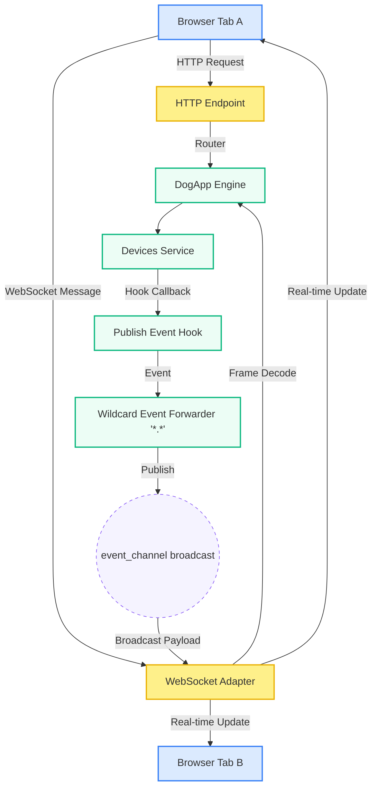

# IoT Device Controller Dashboard 🎛️⚡

This example shows how to use **DogRS** to build a real-time IoT device dashboard. It uses both **REST HTTP** and **WebSockets** to communicate with the backend. 

The frontend is a dark-themed dashboard built with plain HTML, CSS, and JavaScript. It lets you register, control, and delete devices, while viewing the raw messages sent between the frontend and backend in real-time.

---

## 🏗️ Architecture Flow

This diagram shows how HTTP requests and WebSocket messages flow through the backend and broadcast updates to all connected browser tabs:



---

## 🌟 Key Features

### 1. HTTP and WebSockets Together
DogRS lets you route both REST HTTP requests (under `/api`) and WebSocket connections (under `/ws`) to the same Rust service. You can see this setup in [`main.rs`](file:///Users/samsonssali/WebstormProjects/jitpomi/dogrs/dog-examples/iot-devices/src/main.rs):
```rust
let router = Router::new()
    .nest_service("/api", to_endpoint(http_service))
    .merge(extra_router)
    .fallback_service(
        tower_http::services::ServeDir::new("dog-examples/iot-devices/static")
    );
```

### 2. Multi-Tab Real-Time Sync
*   **Event Forwarder**: [`channels.rs`](file:///Users/samsonssali/WebstormProjects/jitpomi/dogrs/dog-examples/iot-devices/src/channels.rs) listens for any change on the service model using a wildcard (`*.*`). It packages these changes and sends them to a broadcast channel.
*   **Instant Updates**: The WebSocket adapter listens to this broadcast channel and pushes updates to all connected browser tabs immediately. Any action taken in one tab updates all other tabs instantly without page reloads or polling.

### 3. Service Hooks
Custom actions, like adjusting a thermostat (`telemetry`) or toggling a switch (`toggle`), run through simple after-hooks in [`devices_hooks.rs`](file:///Users/samsonssali/WebstormProjects/jitpomi/dogrs/dog-examples/iot-devices/src/services/devices/devices_hooks.rs) to trigger the correct WebSocket broadcasts:
```rust
builder.after("devices", ServiceMethodKind::Custom("toggle"), Arc::new(PublishCustomHook));
builder.after("devices", ServiceMethodKind::Custom("telemetry"), Arc::new(PublishCustomHook));
```

---

## 📡 API Reference

### 1. REST API
Every HTTP request must include the header `x-tenant-id: default`.

*   **`GET /api/devices`** - Get all devices.
*   **`GET /api/devices/:id`** - Get a single device.
*   **`POST /api/devices`** - Register a new device.
    *   *Body:* `{"name": "Living Room TV", "type": "light", "value": "off"}`
*   **`DELETE /api/devices/:id`** - Delete a device.

### 2. WebSocket Protocol (`ws://127.0.0.1:3000/ws`)
WebSocket messages are formatted as JSON strings.

#### Client Requests (Send)
```json
{
  "type": "REQUEST",
  "request_id": "optional-uuid-here",
  "service": "devices",
  "method": "toggle",
  "params": {
    "id": "device-3",
    "value": "unlocked"
  }
}
```

#### Server Broadcasts (Receive)
Any changes trigger broadcasts to all connected clients:
```json
{
  "type": "BROADCAST",
  "event": "toggle",
  "payload": {
    "id": "device-3",
    "name": "Front Door Lock",
    "type": "lock",
    "value": "unlocked",
    "status": "online"
  }
}
```

---

## 🚀 Getting Started

### Prerequisites
*   [Rust & Cargo](https://www.rust-lang.org/tools/install) installed.

### Run the Example
1.  Start the server:
    ```bash
    cargo run -p iot-devices
    ```
2.  Open your browser and go to:
    ```
    http://127.0.0.1:3000
    ```

### Test Multi-Client Sync
Open the dashboard in two side-by-side browser windows. Toggle a switch or add a device in one window, and see it update in the other window instantly. You can watch the raw messages scroll in the event logger at the bottom of each page.
