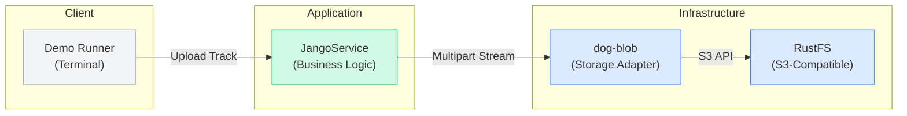

# 🎵 Music Blobs - Storage Demo

A demo showcasing **dog-blob** storage capabilities with real RustFS integration.

## 🚀 Features

### Demo Capabilities
- **Upload tracks** with multipart/resumable support
- **Stream audio** with range requests (scrubbing/seeking)
- **Multi-tenant isolation** - each user has their own library


## 🏗️ Architecture

This application demonstrates **dog-blob** capabilities with real RustFS storage:



### Key Components

- **JangoService**: Music streaming business logic
- **dog-blob**: Storage-agnostic blob management with multipart uploads
- **RustFS**: Production distributed file system via AWS SDK
- **Upload Coordination**: Resumable multipart uploads with session management

## 🎯 Demo Features

This demo showcases:
- **Multi-tenant uploads** (user123 vs user456)
- **Range streaming** for audio scrubbing
- **Multipart uploads** for large files
- **Real RustFS storage** via S3-compatible API
- **Upload session management** with proper state tracking

## 🛠️ Setup & Running

### Prerequisites

- Rust 1.70+
- RustFS instance (local or cloud)
- Environment variables configured

### Option 1: Local RustFS (Development)

1. **Install RustFS locally on macOS:**
   - Download the graphical one-click startup package from [RustFS website](https://docs.rustfs.com/installation/macos/)
   - Modify permissions and double-click to launch
   - Configure disk storage and start service
   - Access console at `http://127.0.0.1:7001`

2. **Set environment variables:**
   ```bash
   export RUSTFS_REGION="local"
   export RUSTFS_ACCESS_KEY_ID="your-admin-username"
   export RUSTFS_SECRET_ACCESS_KEY="your-admin-password"
   export RUSTFS_ENDPOINT_URL="http://127.0.0.1:7001"
   export RUSTFS_BUCKET="jango-music"
   ```

### Option 2: Cloud RustFS (Production)

1. **Set environment variables:**
   ```bash
   export RUSTFS_REGION="your-region"
   export RUSTFS_ACCESS_KEY_ID="your-access-key"
   export RUSTFS_SECRET_ACCESS_KEY="your-secret-key"
   export RUSTFS_ENDPOINT_URL="your-rustfs-endpoint"
   export RUSTFS_BUCKET="jango-music"
   ```

### Run the Demo
```bash
# Navigate to the project
cd dog-examples/music-blobs

# Build and run
cargo run
```

The demo will run and showcase dog-blob capabilities with RustFS storage.

## 🎵 How It Works

The demo runs through these scenarios:

1. **Upload Track** - Store audio data in RustFS via dog-blob
2. **Stream Full Track** - Retrieve and stream complete audio file  
3. **Stream Range** - Demonstrate audio scrubbing with byte ranges
4. **Multi-tenant Upload** - Show user isolation (user123 vs user456)
5. **Multipart Upload** - Handle large files with chunked uploads
6. **Cleanup** - Delete uploaded tracks

## 📊 Key Benefits

### Upload Performance
- **Small files** (< 10MB): Single-shot upload
- **Large files** (> 10MB): Automatic multipart with 5MB chunks
- **Resumable**: Network interruptions handled gracefully
- **Parallel**: Multiple parts uploaded concurrently

### Streaming Performance
- **Range requests**: Efficient audio scrubbing
- **Buffering**: 8KB chunks for smooth playback
- **Caching**: ETag-based browser caching
- **Compression**: Gzip for metadata responses

## 🎉 What This Demonstrates

This example showcases the power of the DogRS ecosystem:

1. **dog-blob eliminates media boilerplate** - No custom multipart logic needed
2. **Storage agnostic** - Same code works with any backend
3. **Production ready** - Handles resumable uploads, range streaming, multi-tenancy
4. **Clean architecture** - Services focus on business logic, not infrastructure
5. **Extensible** - Easy to add features like transcoding, recommendations, social features

**The result**: A complete music streaming service with professional-grade infrastructure, scalable architecture, and rich feature set - all powered by the DogRS ecosystem.
